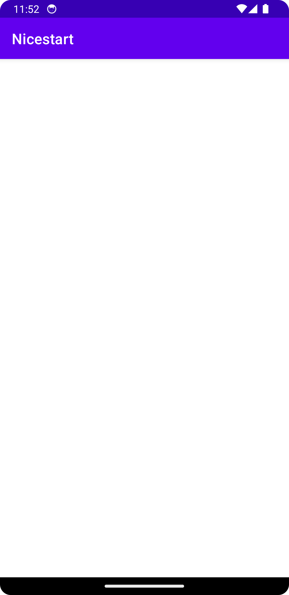

# Nicestart

### Login

En la primera ventana **Login** podemos iniciar sesión o cambiar a la
ventana de registro en el caso de que no tuviesemos una cuenta.

Desde aquí podemos pulsar el botón de **Signup** para entrar en la vista
ventana y registrarnos

O podemos pulsar **Login** y nos mandará al **MainActivity** que está
vacio pero simboliza lo que sería la applicación una vez iniciado sesión

### Sign Up

En la ventana **Signup** hemos utilizado una action bar para poder
volver a la ventana de login

Y además contamos con el botón **Register** con el cual nos llevará al
**MainActivity** una vez pulsado

### Main

Por ultimo tendremos el main que también tendrá una action bar y el
contenido principal de la applicación, de momento vacío.

