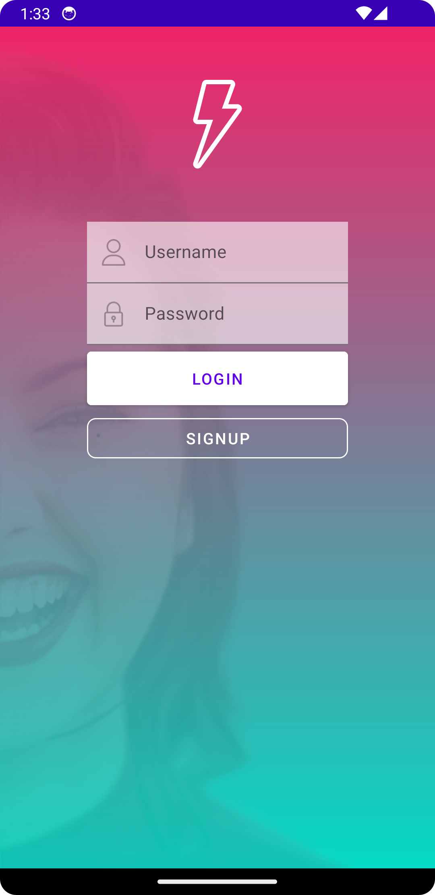
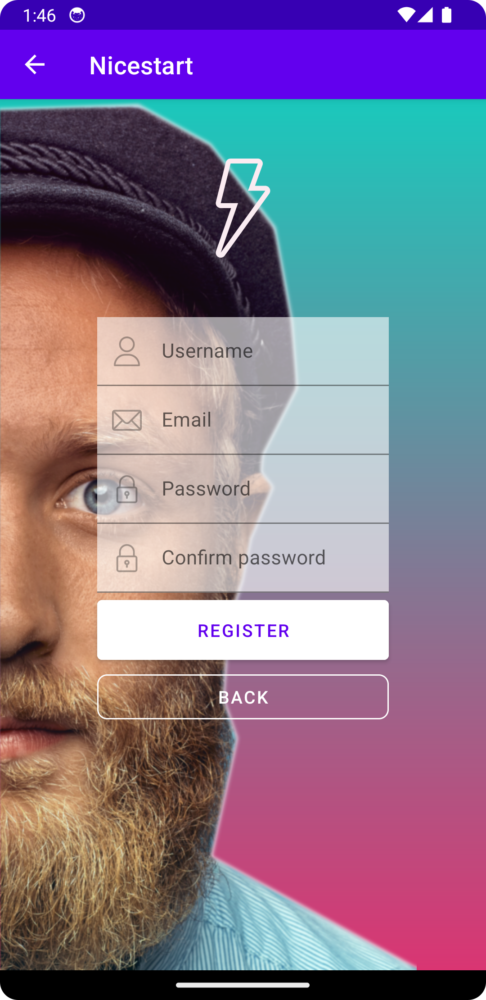
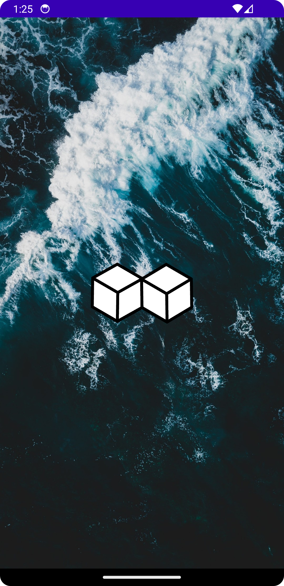
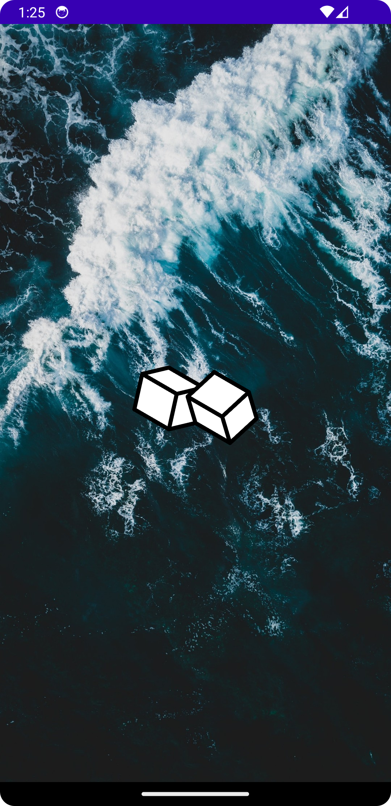
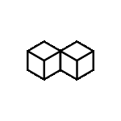
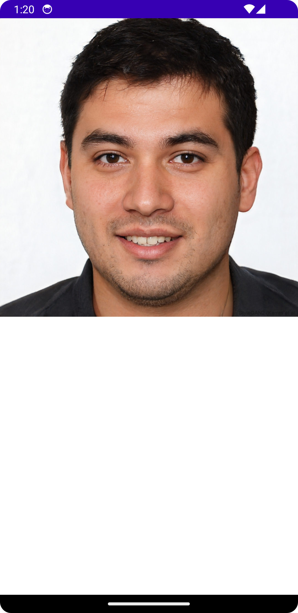
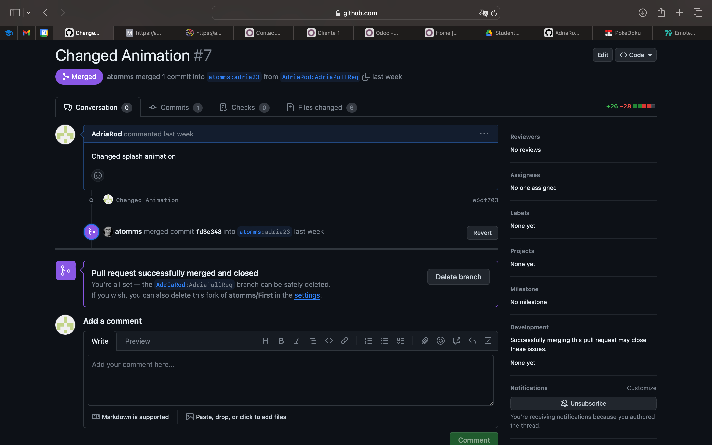

# Nicestart

### Login

En la primera ventana **Login** podemos iniciar sesión o cambiar a la
ventana de registro en el caso de que no tuviesemos una cuenta.

Desde aquí podemos pulsar el botón de **Signup** para entrar en la vista
ventana y registrarnos

O podemos pulsar **Login** y nos mandará al **MainActivity** que está
vacio pero simboliza lo que sería la applicación una vez iniciado sesión

Para esta vista hemos utilizado **alpha** para poner transparencia a la
imagen que hemos añadido usando [Glide](https://github.com/bumptech/glide)

### Sign Up

En la ventana **Signup** hemos utilizado una **action bar** para poder
volver a la ventana de login

Y además contamos con el botón **Register** con el cual nos llevará al
**MainActivity** una vez pulsado

### Main

Por ultimo tendremos el main tendrá en la parte inferior una **Bottom
Bar** que nos permitirá movernos entre distintos apartados de la
aplicacion. Además hay un botón que nos llevará al Activity **NoPeople**

### Splash

He añadido una activity **splash** la cual nos mostrará una imagen
haciendo uso de [Glide](https://github.com/bumptech/glide) para el
tiempo en el que la aplicación está cargando.

También he añadido una animación dentro del mismo splash para el que
hemos usado [Lottie](https://github.com/airbnb/lottie-android) para que
en todo momento el usuario vea que la aplicación está cargando.

### Nopeople

Nopeople es un apartado de la aplicación el cual mediante el uso de
**SwipeRefresh** y **WebView** se ha creado una vista con un vinculo a
una web que mostrará caras de personas que no existen y perimitirá
refrescar para mostrar una nueva cara

## Pull Request
He hecho un [Pull Request](https://github.com/atomms/First/pull/7) a la
rama [adria23](https://github.com/atomms/First/tree/adria23) en el repositorio del profesor Ernesto

